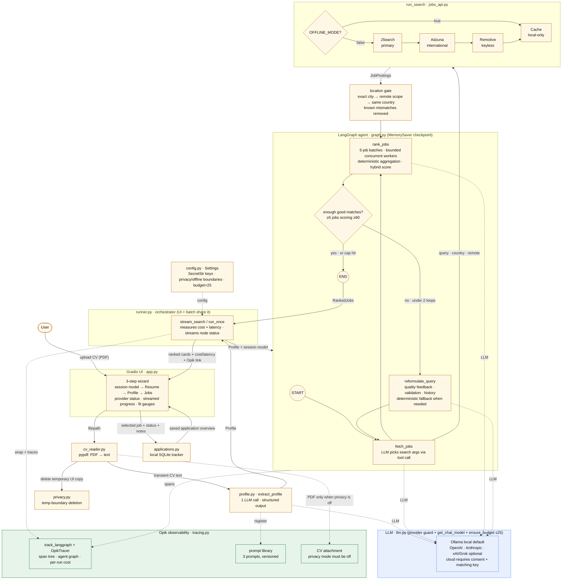

# the-agent-that-got-me-rejected architecture

Grounded in the current code (`src/job_scout/…`). Renders anywhere Mermaid is
supported (GitHub, most blog engines). Legend: **solid arrows** = data flow,
**dotted arrows** = cross-cutting concerns (LLM calls, Opik tracing, config).

The diagram above is also available as editable Mermaid source:

## Reading it

1. **Provider → upload → text → profile.** The first page combines a provider
   and model identifier into a canonical session model. It checks local or
   cloud readiness before reading the PDF and never stores keys in browser
   state. The Gradio wizard then hands the PDF to `cv_reader`
   (pypdf), then `extract_profile` turns the text into a typed `Profile` with one
   structured-output LLM call before the graph, so it is extracted once. In
   privacy mode the temporary UI upload is deleted after reading, and raw text
   is not stored in Gradio state or passed into LangGraph.
2. **The agent graph.** `runner.py` feeds the profile into the LangGraph:
   `fetch_jobs` (the LLM chooses the search arguments) → `rank_jobs` (batched
   model assessment plus deterministic skill, role, seniority, and location
   components) → a conditional edge that either loops through
   `reformulate_query` (max 2) to broaden the search, or ends. The displayed
   score uses 60% deterministic rules and 40% model assessment. Displayed skill
   matches and gaps are reconstructed from profile and job evidence instead of
   trusting the model lists directly. Independent five-job assessment batches
   run through a bounded worker pool and are reassembled by original batch
   index, so completion timing cannot alter aggregation.
3. **Controlled reformulation.** When quality is low, the node summarizes scores,
   validates a novel two-to-eight-term query, and records an audit entry. A
   deterministic adjacent-role fallback replaces invalid or repeated output.
   The fetch node executes this query directly and prioritizes new unique jobs
   during the 25-result merge.
4. **Job sources.** `fetch_jobs` calls `run_search`. With `OFFLINE_MODE=true`,
   it returns directly from the committed cache and never initializes a live
   adapter. With offline mode disabled, it uses the JSearch → Adzuna → Remotive
   → cache cascade.
5. **Location gate.** Every preferred profile location is normalized locally.
   Exact city matches rank above eligible remote scopes and same-country
   fallbacks; known geographical mismatches are removed before LLM ranking.
6. **Cross-cutting (dotted).** Every node's LLM call goes through `llm.py`
   (provider guard, provider-agnostic model factory, and per-run call budget).
   The selected model travels in LangGraph state, so profile extraction and all
   graph nodes use one session-scoped choice without mutating process settings.
   Ollama is local by default. OpenAI, Anthropic, and xAI/Grok require
   `OFFLINE_MODE=false`, `CLOUD_LLM_ENABLED=true`, and a matching key. **Opik**
   is available only when
   both offline mode and privacy mode are disabled and tracing is explicitly
   configured. Privacy mode also blocks PDF attachments and excludes the
   candidate name from ranking prompts. `config.py` supplies keys, both
   boundaries, and other settings.
7. **Application tracker.** Ranked results remain temporary until the user
   explicitly saves one. `applications.py` then upserts a job snapshot, one of
   six validated statuses, private notes, and timestamps in local SQLite. The
   tracker does not persist CV text, candidate profiles, prompts, model output,
   or credentials. `Start over` clears the wizard session but deliberately
   leaves saved applications intact.
