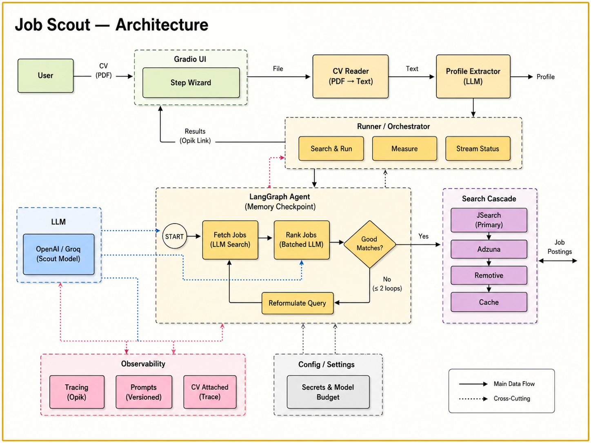
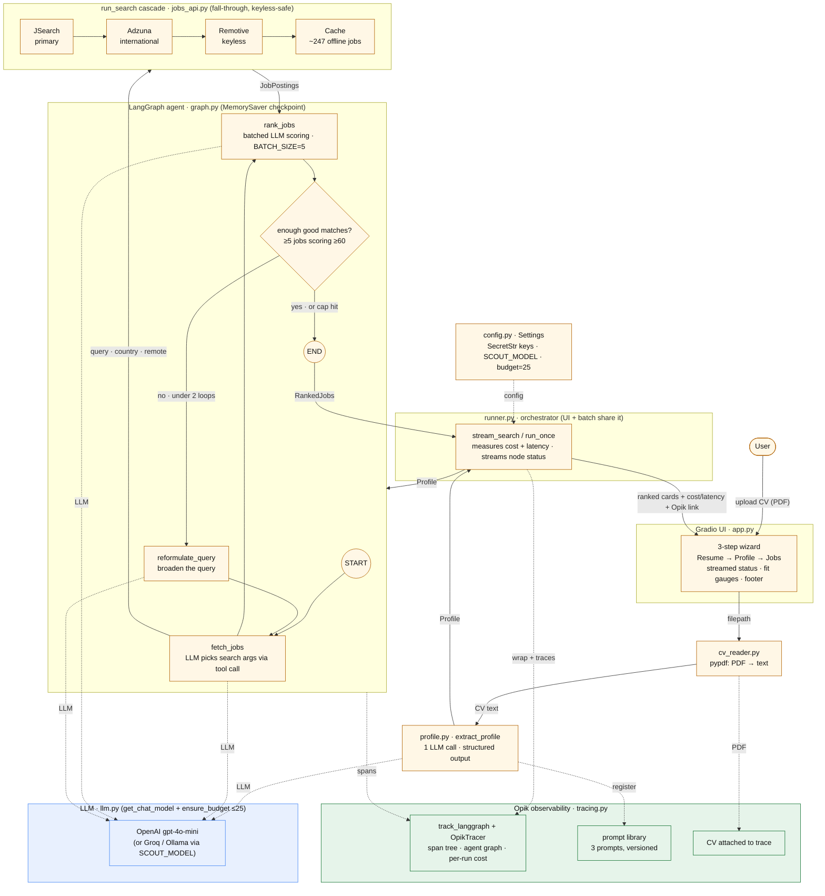

# Job Scout — Architecture

Grounded in the current code (`src/job_scout/…`). Renders anywhere Mermaid is
supported (GitHub, most blog engines). Legend: **solid arrows** = data flow,
**dotted arrows** = cross-cutting concerns (LLM calls, Opik tracing, config).

The diagram above is also available as editable Mermaid source:

## Reading it

1. **Upload → text → profile.** The Gradio wizard hands the PDF to `cv_reader`
   (pypdf), then `extract_profile` turns the text into a typed `Profile` with one
   structured-output LLM call — *before* the graph, so it's extracted once.
2. **The agent graph.** `runner.py` feeds the profile into the LangGraph:
   `fetch_jobs` (the LLM chooses the search arguments) → `rank_jobs` (batched fit
   scoring) → a conditional edge that either loops through `reformulate_query`
   (max 2) to broaden the search, or ends.
3. **Job sources.** `fetch_jobs` calls the `run_search` cascade — JSearch →
   Adzuna → Remotive → offline cache — each tried only if the previous returned
   too few, so it runs with **zero API keys**.
4. **Cross-cutting (dotted).** Every node's LLM call goes through `llm.py`
   (provider-agnostic + a per-run call budget). **Opik** wraps the whole graph in
   one line (`track_langgraph`), producing a span tree, the auto-drawn agent
   graph, per-run cost, the versioned prompt library, and the CV attached to the
   trace. `config.py` supplies keys and settings.
